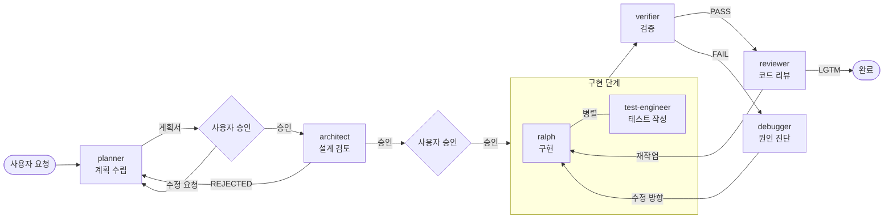
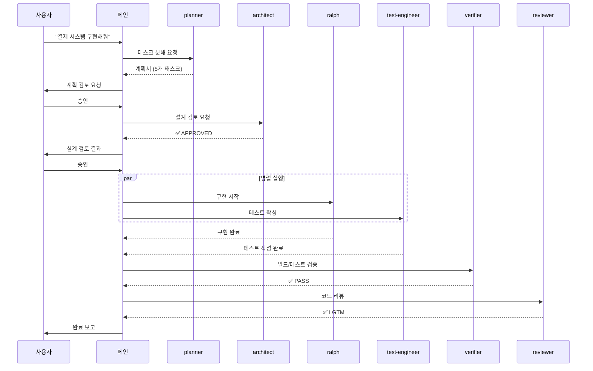
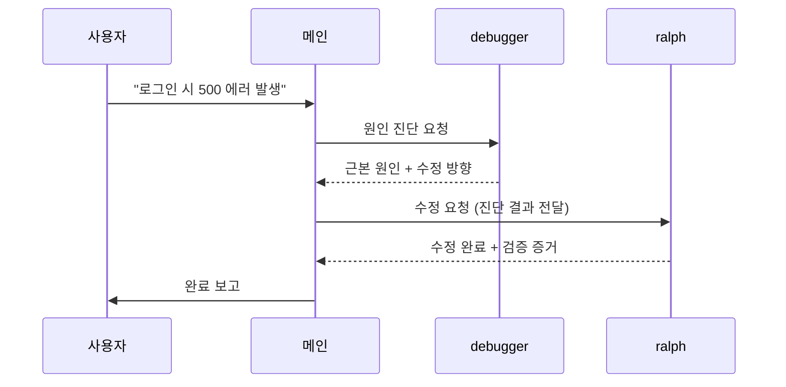
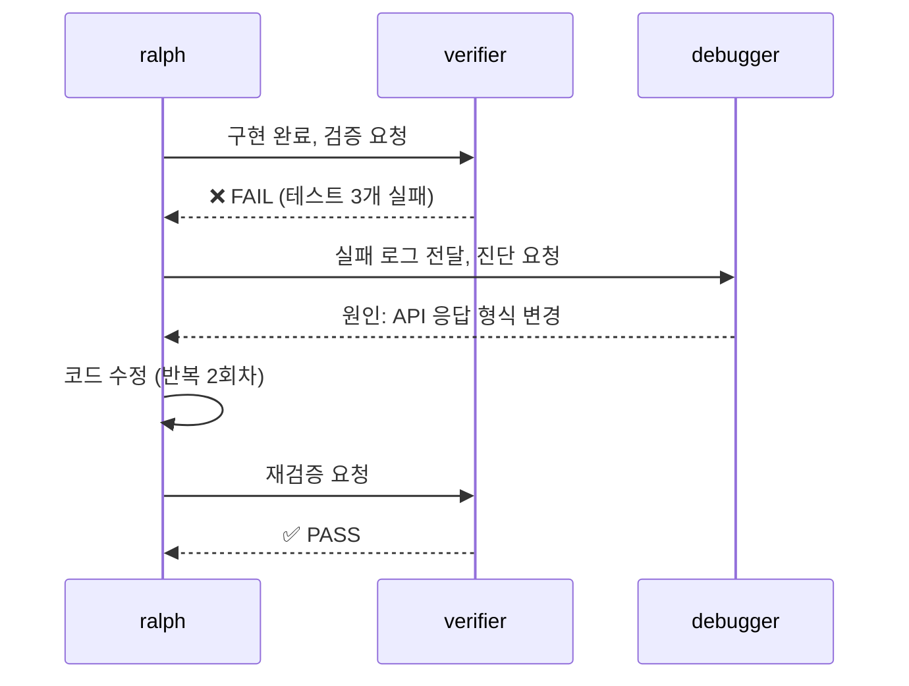
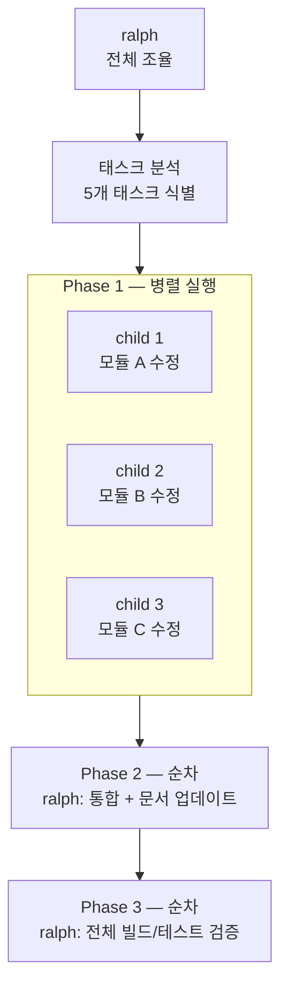
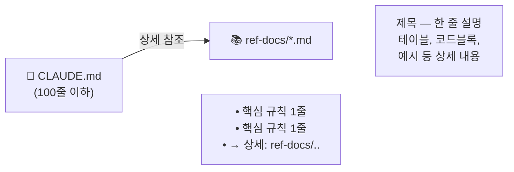

# dotclaude

Claude Code를 더 똑똑하게 — 에이전트, 자동 기록, 실시간 HUD를 한번에 세팅

명령어 하나(`/dotclaude-init`)로 프로젝트에 자동화된 개발 환경이 만들어집니다.

---

## 이런 문제를 해결합니다

| 문제 | dotclaude 적용 후 |
|------|------------------|
| 세션(대화창)이 바뀌면 이전 작업 맥락이 리셋됨 | 작업 내용을 DB에 자동 기록 → 다음 세션에서 자동 복구 |
| 대화가 길어지면 Claude가 편집 중이던 파일을 잊음 (compaction) | Hook이 작업 중 파일과 에러 정보를 자동 캡처해 복구 |
| 큰 기능을 요청하면 설계 없이 바로 코딩해서 엉켜버림 | planner → architect → 구현 → 검증 파이프라인 자동화 |
| Rate limit (사용량 한도) 초과 직전인지 모르고 차단됨 | HUD가 세션/주간 사용량을 실시간으로 표시 |
| 프로젝트마다 에이전트, 훅, DB를 일일이 세팅해야 함 | `/dotclaude-init` 한 번으로 전체 환경 자동 생성 |

---

## 설치

### 원라인 설치 (추천)

```bash
curl -fsSL https://raw.githubusercontent.com/leonardo204/dotclaude/main/install.sh | bash
```

기존 `~/.claude/` 설정이 있으면 `~/.claude.pre-dotclaude/`로 자동 백업됩니다.

### 수동 설치

```bash
git clone https://github.com/leonardo204/dotclaude.git
cd dotclaude && bash install.sh
```

### 프로젝트 초기화

설치 후 프로젝트 폴더에서 Claude Code를 열고 아래 명령어를 실행합니다:

```
/dotclaude-init        # 새 프로젝트 — .claude/ 환경 자동 생성
/dotclaude-update      # 기존 프로젝트 — 최신 업데이트 적용
```

---

## 주요 기능

### 🤖 자동 에이전트 시스템

7개의 전문 에이전트가 역할을 나눠 복잡한 작업을 처리합니다.

| 에이전트 | 역할 | 코드 수정 |
|----------|------|:---------:|
| **ralph** | 끈질긴 구현 — 빌드+테스트 통과까지 절대 멈추지 않음 | 가능 |
| **planner** | 요청 분석 → 태스크 분해 + 수용 기준 정의 | 불가 |
| **architect** | 설계 및 아키텍처 타당성 검토 | 불가 |
| **verifier** | 빌드/테스트/타입체크 결과 기반 검증 | 불가 |
| **reviewer** | 코드 리뷰 (보안, 정확성, 품질) | 불가 |
| **debugger** | 버그/에러 근본 원인 진단 | 불가 |
| **test-engineer** | 테스트 전략 수립 + 테스트 코드 작성 | 가능 |

#### 팀 모드 (구현 파이프라인)

"로그인 기능 추가해줘"처럼 규모 있는 요청을 받으면 에이전트들이 팀으로 자동 협업합니다.



**팀 모드 발동 조건**:

| 조건 | 예시 | 동작 |
|------|------|------|
| 새 기능 + 2개 이상 파일 수정 예상 | "로그인 기능 추가해줘" | 파이프라인 자동 제안 |
| 아키텍처 변경 수반 | "인증을 JWT에서 세션으로 바꿔줘" | 파이프라인 자동 제안 |
| "구현해줘/만들어줘" + 구체적 명세 | "댓글 시스템 구현해줘" | 파이프라인 자동 제안 |
| `/dotclaude-implement` 명시 실행 | `/dotclaude-implement` | 즉시 파이프라인 실행 |
| 단순 수정/버그 수정 | "이 에러 고쳐줘" | ralph 단독 또는 직접 처리 |

#### 시나리오별 에이전트 동작

**시나리오 1: 새 기능 구현** — "결제 시스템 구현해줘"



**시나리오 2: 버그 수정** — "로그인 시 500 에러 발생"



**시나리오 3: 검증 실패 → 자동 복구** — verifier가 FAIL을 반환한 경우



**시나리오 4: 대규모 리팩토링** — ralph가 child agent를 생성하는 경우



#### 단독 에이전트 사용

팀 모드가 아닌 개별 에이전트만 호출되는 경우:

| 상황 | 호출 에이전트 | 예시 |
|------|:------------:|------|
| 단순 버그 수정 | ralph | "이 버튼 클릭 안 돼요" |
| 코드 리뷰만 | reviewer | "이 PR 리뷰해줘" |
| 테스트 보강 | test-engineer | "이 모듈 테스트 추가해줘" |
| 원인 분석만 | debugger | "왜 빌드가 안 되는지 알려줘" |
| 설계 피드백 | architect | "이 구조 괜찮을까?" |
| 작업 계획만 | planner | "이거 하려면 뭘 해야 해?" |
| 구현 완료 후 검증 | verifier | 구현 후 자동 호출 |

**Ralph 에이전트**: 핵심 구현 에이전트. 빌드 에러가 나면 고치고, 테스트가 실패하면 수정하고, 완료 조건이 충족될 때까지 최대 10회 반복합니다. "대략 동작합니다"를 허용하지 않습니다.

**MCP 팀 협업**: 여러 에이전트가 Context DB를 통해 실시간으로 정보를 공유합니다. `team_dispatch`로 워커 에이전트에게 태스크를 전달하고, `team_context`로 중간 결과를 공유합니다. 별도 설정 없이 기본 활성화되어 있습니다.

---

### 🛡️ 컨텍스트 보호 (Compaction 대응)

Claude Code는 대화가 길어지면 이전 내용을 압축(compaction)합니다. 이때 편집 중이던 파일 경로나 직전 에러 정보를 잊어버려 작업이 끊기는 문제가 생깁니다.

dotclaude는 Hook을 통해 핵심 상태를 자동으로 DB에 기록하고, compaction 이후에도 작업 흐름이 이어지도록 합니다.

**자동 캡처 항목**

| 항목 | 캡처 시점 | 내용 |
|------|-----------|------|
| `working_files` | 컨텍스트 70% 도달 시 | 편집 중인 파일 경로 (최대 20개) |
| `error_context` | 에러 발생 시 | 에러 유형 + 관련 파일 경로 |
| `session_summary` | 세션 종료 시 | 이번 세션 편집 파일 수 + 목록 |
| `_rules` | 세션 시작 시 | CLAUDE.md 핵심 지침 |
| `current_task` | 수동 저장 | 현재 진행 중인 작업 설명 |

**3단계 차등 주입**: 매 턴마다 컨텍스트 사용률을 확인해 상황에 맞게 정보를 주입합니다.

- 기본 (70% 미만): 세션 요약만 표시
- 경고 (70~90%): working_files, error_context 추가 주입
- 복구 (compaction 감지): DB에서 전체 상태를 불러와 자동 복구

---

### 📊 HUD (실시간 상태 표시줄)

Claude Code 하단에 현재 사용량과 환경 정보를 실시간으로 표시합니다.

```
[CC#1.0.80] | ~/work/myproject | 5h:39%(2h37m) wk:15%(4d7h) | Opus | ctx:14% | agents:3
 ─────────    ────────────────   ────────────────────────────   ────   ───────   ────────
  CC 버전          작업 경로      세션 사용량     주간 사용량    모델    맥락%   활성 에이전트
```

| 항목 | 설명 |
|------|------|
| CC 버전 | 현재 Claude Code 버전 |
| 작업 경로 | 현재 디렉토리 |
| 세션 사용량 | 이번 세션에서 소모한 Rate limit 비율 + 남은 시간 |
| 주간 사용량 | 이번 주 누적 사용량 비율 |
| 모델 | 현재 사용 중인 Claude 모델 |
| 맥락% | 현재 대화 컨텍스트 사용률 |
| 활성 에이전트 | 현재 실행 중인 서브에이전트 수 |

Rate limit 정보는 백그라운드에서 주기적으로 갱신되어 API 블로킹이 없습니다. HUD 표시 자체는 로컬 캐시만 읽으므로 응답 속도에 영향을 주지 않습니다.

**HUD 설치 범위**: `install.sh` 실행 시 Global(모든 프로젝트), Project(dotclaude-init한 프로젝트만), Skip(미설치) 중 선택할 수 있습니다. 설치 후에도 `/dotclaude-statusline` 명령으로 언제든 on/off 전환이 가능합니다.

---

### ⚡ 커스텀 명령어

**프로젝트 명령어** (프로젝트 내에서 사용):

| 명령어 | 설명 |
|--------|------|
| `/project:dotclaude-help` | 명령어 및 에이전트 목록 표시 |
| `/project:dotclaude-implement` | 전체 파이프라인 (계획 → 설계 → 구현 → 검증 → 리뷰) 실행 |
| `/project:dotclaude-commit` | 변경 분석 + 문서 업데이트 + 기능별 커밋 |
| `/project:dotclaude-tellme` | 최근 작업 브리핑 + 다음 할 일 제안 |
| `/project:dotclaude-discover` | DB 패턴 분석 → 자동화 제안 |
| `/project:dotclaude-reportdb` | Context DB 전체 현황 리포트 |
| `/project:dotclaude-statusline` | HUD on/off 토글 (`on` / `off` 인자 지원) |

**글로벌 명령어** (모든 프로젝트에서 사용):

| 명령어 | 설명 |
|--------|------|
| `/dotclaude-init` | 프로젝트에 dotclaude 환경 초기화 |
| `/dotclaude-update` | dotclaude 시스템 파일 최신 업데이트 |

**사용 예시**:

```
# 기능 구현 요청 — 파이프라인이 자동으로 계획부터 리뷰까지 처리
/project:dotclaude-implement
> 사용자 인증 기능을 JWT 방식으로 구현해줘

# 오늘 작업 현황 확인
/project:dotclaude-tellme
```

---

### 📄 Slim 문서 정책

CLAUDE.md는 **매 턴 모델에 입력**되므로, 길어지면 응답 속도가 느려집니다. dotclaude는 이를 방지하기 위해 Slim 정책을 적용합니다.

**원칙**: CLAUDE.md는 100줄 이하 유지. 상세 내용은 ref-docs로 분리.



**ref-docs 헤더 규칙**: 모든 참고 문서는 `# 제목 — 한 줄 설명` 형식의 첫 줄을 가집니다. 모델이 파일을 열지 않고도 필요한 문서인지 빠르게 판단할 수 있습니다.

| 문서 | 설명 |
|------|------|
| `ref-docs/agent-delegation.md` | 에이전트 위임 규칙, 파이프라인, 호출 패턴 |
| `ref-docs/context-db.md` | Context DB 스키마, helper.sh 명령어 |
| `ref-docs/context-monitor.md` | HUD + compaction 감지/복구 |
| `ref-docs/hooks.md` | 5개 Hook 역할, 시점, 성능 최적화 |
| `ref-docs/conventions.md` | 커밋, 주석, 로깅 컨벤션 |
| `ref-docs/setup.md` | 새 환경 초기 설정 가이드 |

**새 지침 추가 시**:
1. 매 턴 참조 필요 → CLAUDE.md에 1줄 추가
2. 상세/예시/테이블 → ref-docs에 작성 후 CLAUDE.md에서 참조
3. 프로젝트별 규칙 → 프로젝트 CLAUDE.md의 PROJECT 섹션에 추가

---

## 요구 사항

- **Claude Code** (CLI)
- **Node.js 22 이상** (내장 SQLite 모듈 사용)
- **sqlite3** (CLI 도구 — 없으면 install.sh가 자동 설치)

---

## 제거

```bash
# 로컬 실행 (확인 프롬프트 표시)
bash uninstall.sh

# 원격 실행
curl -fsSL https://raw.githubusercontent.com/leonardo204/dotclaude/main/uninstall.sh | bash -s -- -y
```

dotclaude가 설치한 파일만 삭제하며, 사용자가 추가한 파일은 보존됩니다.

---

## License

MIT
