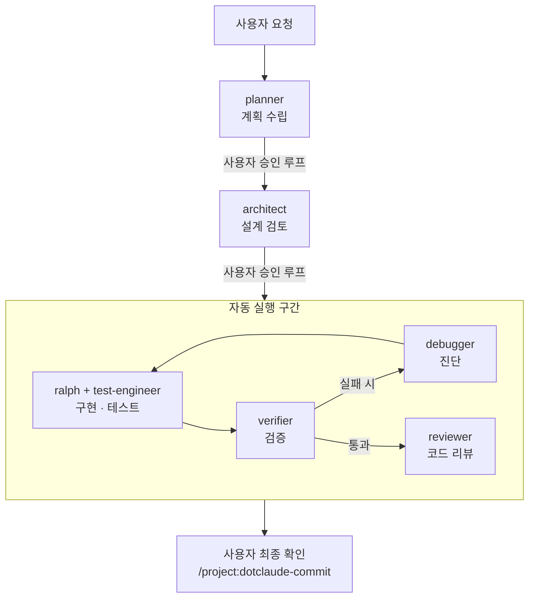
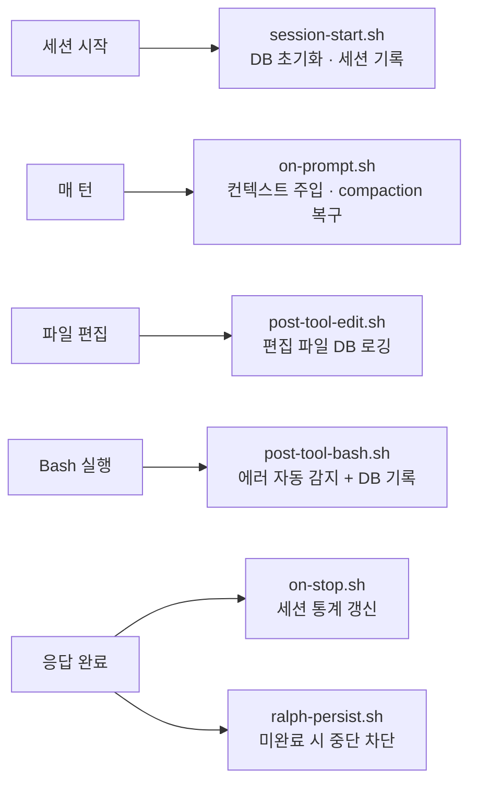
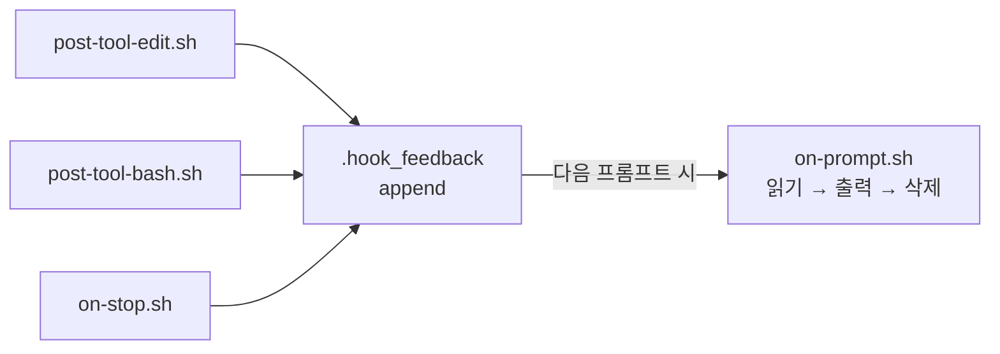

# dotclaude

> Claude Code 프로젝트 스타터 킷 — 새 프로젝트에 Claude Code 개발 환경을 빠르게 구축

**Claude Code 네이티브 기능만**으로 동작합니다.
커맨드 하나(`/dotclaude-init`)로 에이전트, 훅, DB, HUD가 세팅됩니다.

---

## 이런 문제를 해결합니다

| 문제 | dotclaude의 해법 |
|------|-----------------|
| 세션이 바뀌면 이전 작업 맥락을 잊어버림 | SQLite DB + Hook이 세션/태스크/결정을 자동 기록 |
| 컨텍스트가 꽉 차면 작업 상태가 유실됨 | compaction 감지 → `live_context` 테이블에서 자동 복구 |
| "이거 구현해줘" 하면 중간에 멈추거나 대충 마무리 | Ralph 에이전트가 빌드+테스트 통과까지 끈질기게 반복 |
| 매번 같은 커밋/브리핑 작업을 수동으로 | `/project:dotclaude-commit`, `/project:dotclaude-tellme` 등 명령어로 자동화 |
| 프로젝트마다 Claude Code 설정을 처음부터 구성 | `/dotclaude-init` 한 번으로 전체 환경 세팅 |

---

## 설치

### 원라인 설치 (추천)

```bash
curl -fsSL https://raw.githubusercontent.com/leonardo204/dotclaude/main/install.sh | bash
```

기존 `~/.claude/` 설정이 있으면 `~/.claude.pre-dotclaude/`로 자동 백업됩니다.

### 수동 설치

```bash
git clone https://github.com/leonardo204/dotclaude.git
cd dotclaude
bash install.sh
```

또는 직접 파일을 복사할 수도 있습니다:

```bash
git clone https://github.com/leonardo204/dotclaude.git
cd dotclaude
mkdir -p ~/.claude/commands ~/.claude/scripts
cp -r global/* ~/.claude/
```

`~/.claude/settings.json`에 statusLine이 포함되어 있습니다. 기존 settings.json이 있었다면 백업에서 필요한 설정을 머지하세요.

### 설치 후 프로젝트 적용

```bash
cd my-project && git init
claude
> /dotclaude-init        # 새 프로젝트
> /dotclaude-migration   # 기존 프로젝트
```

이 명령을 실행하면 프로젝트 `.claude/` 폴더에 아래가 자동 생성됩니다:

```
.claude/
├── agents/      ← 7개 커스텀 에이전트
├── commands/    ← 6개 슬래시 명령어
├── hooks/       ← 6개 자동 실행 스크립트
├── db/          ← SQLite DB + CLI 도구
└── scripts/     ← HUD statusline
```

---

## 제거

```bash
# 로컬 실행 (확인 프롬프트 표시)
bash uninstall.sh

# 원격 실행 (-y 필수)
curl -fsSL https://raw.githubusercontent.com/leonardo204/dotclaude/main/uninstall.sh | bash -s -- -y
```

dotclaude가 설치한 파일만 삭제하며, 사용자가 추가한 파일은 보존됩니다.
백업(`~/.claude.pre-dotclaude/`)이 있으면 복원 방법을 안내합니다.

---

## 핵심 기능

### 🤖 에이전트 시스템

Claude Code는 `.claude/agents/` 폴더에 마크다운 파일을 두면 **커스텀 에이전트**를 정의할 수 있습니다.
각 에이전트는 전문 역할을 가지며, 메인 에이전트가 필요에 따라 위임합니다.

| 에이전트 | 역할 | 코드 수정 |
|----------|------|:---------:|
| **ralph** | 끈질긴 구현 — 빌드+테스트 통과까지 절대 멈추지 않음 | ✅ |
| **planner** | 요청 분석 → 태스크 분해 + 수용 기준 정의 | ❌ |
| **architect** | 설계/아키텍처 타당성 검토 | ❌ |
| **verifier** | 빌드/테스트/타입체크 증거 기반 검증 | ❌ |
| **reviewer** | 코드 리뷰 (보안, 정확성, 품질) | ❌ |
| **debugger** | 버그/에러 근본 원인 진단 | ❌ |
| **test-engineer** | 테스트 전략 수립 + 테스트 코드 작성 | ✅ |

> **Ralph란?** "포기하지 않는" 구현 에이전트입니다.
> 작업 시작 시 태스크를 분해하고 의존성을 분석하여 **Task Map**을 출력합니다.
> 독립 태스크는 **child agent를 병렬 생성**하여 동시 처리하고, 의존 관계가 있으면 순차 실행합니다.
> `TaskCreate`/`TaskUpdate` 도구로 진행 상황을 실시간 추적합니다.
> Stop 이벤트 Hook(`ralph-persist.sh`)이 미완료 상태에서의 중단을 차단합니다.

### 🔄 구현 파이프라인 (`/project:dotclaude-implement`)

복잡한 기능 구현을 자동화하는 멀티 에이전트 파이프라인입니다:



- **Phase 1-2** (계획/설계): 사용자가 승인할 때까지 수정 반복
- **Phase 3-5** (구현/검증/리뷰): 자동 실행, 실패 시 debugger → ralph 루프
- 에이전트는 파이프라인 없이 **단독 사용**도 가능 (예: "이 버그 원인 좀 찾아줘" → debugger)

### 🪝 Hook 시스템

Claude Code의 **Hook**은 특정 이벤트(세션 시작, 파일 편집, 응답 완료 등) 발생 시 자동으로 실행되는 쉘 스크립트입니다.
`.claude/settings.json`에 등록하면 Claude Code가 해당 시점에 자동 호출합니다.



모든 Hook은 **순수 bash + sqlite3**로 동작하며, 외부 의존성이 없습니다.

**피드백 릴레이 패턴**: Claude Code의 Hook stdout 가시성은 이벤트 유형에 따라 다릅니다:
- `SessionStart`/`UserPromptSubmit` → stdout이 **컨텍스트에 주입**되어 AI가 읽을 수 있음
- `PostToolUse`/`Stop` → stdout이 **verbose 모드**(Ctrl+O)에서만 표시됨

이 제약을 우회하기 위해 **축적 릴레이** 방식을 사용합니다:

사용자는 매 턴 `[hook-feedback] 지난 턴 이후 DB 활동:` 형태로 피드백을 받습니다.

### 💾 Context DB

세션 간 작업 맥락을 유지하는 **SQLite 데이터베이스**입니다.
Hook이 자동으로 데이터를 기록하고, AI가 매 턴 참조합니다.

```
┌─ sessions      세션 시작/종료 시간, 편집 파일 수
├─ tasks         할 일 목록 (우선순위, 상태)
├─ decisions     설계 결정 기록
├─ errors        에러 발생 이력 (자동 분류)
├─ tool_usage    파일 편집 로그
├─ commits       커밋 기록
└─ live_context  compaction 복구용 KV 저장소
```

CLI 도구로 직접 조회/수정도 가능합니다:

```bash
bash .claude/db/helper.sh task-add "로그인 기능 구현" 1      # 태스크 추가 (우선순위 1)
bash .claude/db/helper.sh task-list                          # 태스크 목록
bash .claude/db/helper.sh task-done 3                        # 태스크 완료
bash .claude/db/helper.sh decision-add "JWT 인증 방식 채택"   # 결정 기록
bash .claude/db/helper.sh stats                              # 전체 통계
bash .claude/db/helper.sh live-set current_task "API 구현"    # 실시간 상태 저장
```

### 📊 HUD Statusline

Claude Code 하단에 실시간 정보를 표시하는 **statusline**입니다:

```
[CC#1.0.80] | ~/work/myproject | 5h:39%(2h37m) wk:15%(4d7h) | Opus | ctx:14% | agents:3
 ─────────    ────────────────   ──────────────────────────   ────   ───────   ────────
  CC 버전          CWD           세션 리밋     주간 리밋      모델   컨텍스트%  활성 에이전트
```

| 항목 | 데이터 소스 | 설명 |
|------|------------|------|
| CC 버전 | stdin JSON | Claude Code 버전 |
| CWD | stdin JSON | 현재 작업 디렉토리 (`~` 축약) |
| 세션/주간 리밋 | Anthropic OAuth API | 사용률 % + 리셋 잔여 시간 (토큰 자동 refresh) |
| 모델 | stdin JSON | 현재 사용 중인 모델 (Opus, Sonnet, Haiku) |
| ctx% | stdin JSON | 컨텍스트 윈도우 사용률 (70%+ 경고, 85%+ CRITICAL) |
| agents | 서브에이전트 transcript | 활성 에이전트 수 (활성 시 노란색, 0이면 dim) |

> OAuth 인증 불가 시 리밋 슬롯은 자동 생략됩니다. 429 rate limit 발생 시 토큰 자동 refresh + exponential backoff로 복구합니다.
>
> stdin이 없거나 에러 발생 시에도 HUD가 사라지지 않고 fallback 메시지(`(waiting for data)` 또는 에러 내용)를 표시합니다.

### ⌨️ 커스텀 명령어

Claude Code의 **Commands**는 `.claude/commands/` 폴더에 마크다운 파일로 정의하는 슬래시 명령어입니다.
반복 작업을 표준화합니다.

| 명령어 | 설명 |
|--------|------|
| `/project:dotclaude-help` | 명령어 및 에이전트 목록 표시 |
| `/project:dotclaude-implement` | 전체 파이프라인 (계획 → 설계 → 구현 → 검증 → 리뷰) |
| `/project:dotclaude-commit` | 변경 분석 + 문서 업데이트 + 기능별 커밋 |
| `/project:dotclaude-tellme` | 최근 작업 브리핑 + 다음 할 일 제안 |
| `/project:dotclaude-discover` | DB 패턴 분석 → 자동화 제안 |
| `/project:dotclaude-reportdb` | Context DB 전체 현황 리포트 |

---

## 폴더 구조

```
dotclaude/
├── install.sh                         ← 원라인 글로벌 설치 스크립트
├── uninstall.sh                       ← 글로벌 설정 제거 스크립트
├── global/                            ← ~/.claude/ 에 배치하는 글로벌 설정
│   ├── CLAUDE.md                      # 글로벌 개발 가이드
│   ├── settings.json                  # statusline + 플러그인 설정
│   ├── commands/                      # 글로벌 명령어
│   │   ├── dotclaude-init.md          #   /dotclaude-init (새 프로젝트)
│   │   └── dotclaude-migration.md     #   /dotclaude-migration (기존 프로젝트)
│   ├── scripts/
│   │   └── context-monitor.mjs        #   HUD statusline 스크립트
│   └── MEMORY-example.md             # 자동 메모리 예시
│
├── project-local/                     ← 프로젝트 .claude/ 에 배치되는 템플릿
│   ├── CLAUDE.md                      # 프로젝트 가이드 (COMMON + PROJECT)
│   ├── settings.json                  # Hook 등록
│   ├── agents/                        # 커스텀 에이전트 (7개)
│   ├── commands/                      # 슬래시 명령어 (6개)
│   ├── hooks/                         # 자동 실행 스크립트 (6개)
│   ├── db/                            # Context DB 스키마 + CLI
│   └── scripts/                       # HUD 스크립트
│
└── ref-docs/                          ← 참고 문서
    ├── context-db.md                  # DB 스키마 상세
    ├── context-monitor.md             # HUD + compaction 대응 상세
    ├── conventions.md                 # 커밋/코드 컨벤션
    └── setup.md                       # 새 PC 셋업 가이드
```

---

## 사용 시나리오

### 새 프로젝트

```bash
mkdir my-app && cd my-app && git init
claude                    # Claude Code 실행
```

```
> /dotclaude-init          # .claude/ 환경 자동 생성
```

생성 후 `CLAUDE.md`의 **PROJECT 섹션**을 프로젝트에 맞게 작성하면 끝.

### 기존 프로젝트 전환

```
> /dotclaude-migration     # 기존 설정 백업 + 머지
```

- 기존 `.claude/` 설정을 `.claude/.backup-{timestamp}/`에 백업
- 기존 hooks/commands 보존하며 시스템 구성 요소 머지
- 기존 `CLAUDE.md`를 COMMON + PROJECT 구조로 재구성 (상세 내용은 문서로 분리)

### 일상 작업 흐름

```
> /project:dotclaude-tellme              # "어디까지 했더라?" — 최근 작업 브리핑

> /project:dotclaude-implement 로그인 기능 추가해줘
  # planner → architect → ralph → verifier → reviewer 자동 실행

> /project:dotclaude-commit              # 변경 분석 + 기능별 커밋
```

---

## 설계 원칙

| 원칙 | 설명 |
|------|------|
| **네이티브 전용** | Claude Code 네이티브 기능만 사용 (Agent, Hook, Command) |
| **순수 bash + sqlite3** | 외부 런타임 의존 최소화 (node는 HUD 스크립트만) |
| **이식성** | `.claude/` 폴더 복사만으로 어떤 프로젝트에든 적용 |
| **점진적 확장** | 기본 템플릿에서 프로젝트별 에이전트/훅/명령어 추가 |
| **안전한 머지** | 기존 설정 덮어쓰기 금지, 항상 백업 + 머지 |

---

## 요구 사항

- **Claude Code** (CLI)
- **sqlite3** (macOS/Linux 기본 내장)
- **Node.js** (HUD statusline 실행용)

---

## License

MIT
