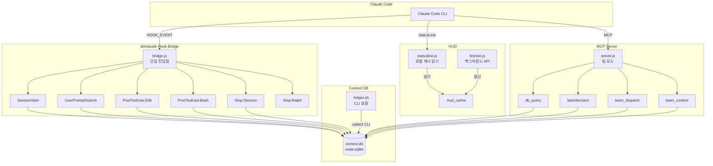
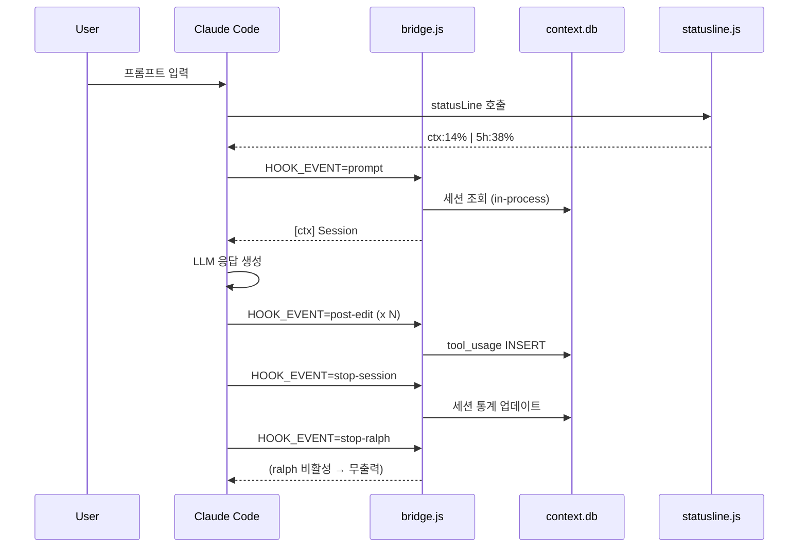
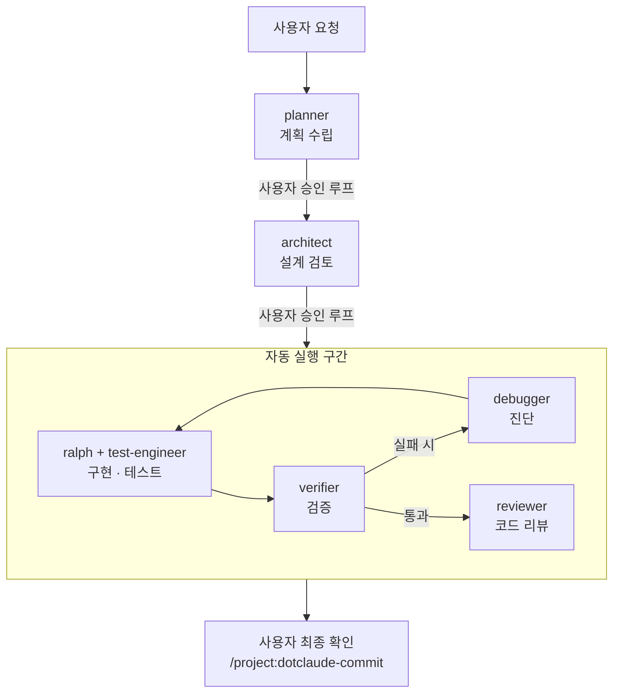

# dotclaude

Claude Code 프로젝트 스타터 킷 — 에이전트, 훅, Context DB, HUD를 한번에 세팅

커맨드 하나(`/dotclaude-init`)로 TypeScript 브릿지 기반 Hook 시스템, SQLite Context DB, 비동기 HUD, MCP 서버가 자동으로 구성됩니다.

---

## 특징

- **TypeScript 브릿지** — 단일 진입점(`bridge.js`), 프로세스 spawn 최소화
- **Context DB** — `node:sqlite` 기반 세션 간 상태 추적 (in-process, 외부 spawn 없음)
- **비동기 HUD** — API 블로킹 0, 로컬 캐시 파일 기반 (`≤10ms` 목표)
- **MCP 서버** — 팀 에이전트 협업, Context DB 원격 접근 (선택적 활성화)
- **Compaction 복구** — 컨텍스트 압축 시 자동 상태 복원
- **Ralph 에이전트** — 빌드+테스트 통과까지 절대 멈추지 않는 구현 에이전트

---

## 아키텍처

### 컴포넌트 구조



### 데이터 흐름



---

## 빠른 시작

### 설치

```bash
# 원라인 설치 (추천)
curl -fsSL https://raw.githubusercontent.com/leonardo204/dotclaude/main/install.sh | bash

# 수동 설치
git clone https://github.com/leonardo204/dotclaude.git
cd dotclaude && bash install.sh
```

기존 `~/.claude/` 설정이 있으면 `~/.claude.pre-dotclaude/`로 자동 백업됩니다.

### 프로젝트 초기화

```bash
cd my-project && git init
claude
```

```
> /dotclaude-init        # 새 프로젝트 — .claude/ 환경 자동 생성
> /dotclaude-update      # 기존 프로젝트 — 최신 업데이트 적용
```

초기화 후 `.claude/` 폴더에 자동 생성되는 구조:

```
.claude/
├── agents/      ← 커스텀 에이전트 (7개)
├── commands/    ← 슬래시 명령어 (6개)
├── dist/        ← 빌드된 TypeScript (bridge.js, statusline.js, server.js)
├── db/          ← Context DB 스키마 + CLI 도구
└── settings.json ← Hook 등록 (HOOK_EVENT 기반)
```

---

## 구성 요소

### Hook 브릿지 (bridge.ts)

모든 Hook 이벤트를 처리하는 **단일 진입점**입니다. `HOOK_EVENT` 환경변수로 이벤트를 구분합니다.

```bash
# settings.json에 등록된 방식 (예시)
HOOK_EVENT=session-start node .claude/dist/hooks/bridge.js
HOOK_EVENT=prompt        node .claude/dist/hooks/bridge.js
HOOK_EVENT=post-edit     node .claude/dist/hooks/bridge.js
HOOK_EVENT=post-bash     node .claude/dist/hooks/bridge.js
HOOK_EVENT=stop-session  node .claude/dist/hooks/bridge.js
HOOK_EVENT=stop-ralph    node .claude/dist/hooks/bridge.js
```

기존 Bash hook 방식(`bash session-start.sh` 등)을 완전히 대체합니다. 주요 장점:

- **in-process DB 접근** — `node:sqlite` 직접 사용, sqlite3 외부 프로세스 spawn 없음
- **단일 프로세스** — 이벤트마다 새 Node.js 프로세스지만, 내부에서 여러 DB 작업을 한 번에 처리
- **타입 안전** — TypeScript로 작성, 빌드 시 타입 검사

| Hook 이벤트 | 처리 내용 |
|-------------|-----------|
| `session-start` | DB 초기화, 세션 생성, CLAUDE.md 지침 캐시 |
| `prompt` | 세션 조회, live_context 주입 (3단계 차등) |
| `post-edit` | tool_usage 기록 (파일 경로, 도구 이름) |
| `post-bash` | 에러 감지 시 분류/로깅 + error_context 캡처 |
| `stop-session` | 세션 통계 업데이트, session_summary 저장 |
| `stop-ralph` | ralph 활성 상태 확인 → 미완료 시 중단 차단 |

### Context DB

세션 간 작업 맥락을 유지하는 **SQLite 데이터베이스**입니다. `node:sqlite` (Node.js 22+ 내장)를 사용하여 외부 프로세스 없이 in-process로 접근합니다.

```
┌─ sessions      세션 시작/종료 시간, 편집 파일 수
├─ tasks         할 일 목록 (우선순위, 상태)
├─ decisions     설계 결정 기록
├─ errors        에러 발생 이력 (자동 분류)
├─ tool_usage    파일 편집 로그
├─ commits       커밋 기록
└─ live_context  compaction 복구용 KV 저장소 (자동 캡처 포함)
```

**자동 캡처**: Hook이 `live_context`에 핵심 상태를 자동으로 기록합니다:

| 키 | 캡처 시점 | 내용 |
|----|-----------|------|
| `_rules` | 세션 시작 시 | `~/.claude/CLAUDE.md` 주요 지침 |
| `_project_rules` | 세션 시작 시 | 프로젝트 `CLAUDE.md` PROJECT 섹션 |
| `working_files` | ctx 70%+ 도달 시 | 편집 파일 경로 (최대 20개) |
| `error_context` | 에러 감지 시 | 최근 에러 타입 + 파일 경로 |
| `session_summary` | 세션 종료 시 | 편집 파일 수 + 파일 목록 요약 |

CLI 도구로 직접 조회/수정도 가능합니다 (`helper.sh` — sqlite3 CLI 호환):

```bash
bash .claude/db/helper.sh task-add "로그인 기능 구현" 1
bash .claude/db/helper.sh task-list
bash .claude/db/helper.sh decision-add "JWT 인증 방식 채택"
bash .claude/db/helper.sh stats
bash .claude/db/helper.sh live-set current_task "API 구현"
bash .claude/db/helper.sh live-get working_files
```

### HUD (statusline)

Claude Code 하단에 실시간 정보를 표시하는 **statusline**입니다.

```
[CC#1.0.80] | ~/work/myproject | 5h:39%(2h37m) wk:15%(4d7h) | Opus | ctx:14% | agents:3
 ─────────    ────────────────   ──────────────────────────   ────   ───────   ────────
  CC 버전          CWD           세션 리밋     주간 리밋      모델   컨텍스트%  활성 에이전트
```

**성능 설계**: API 블로킹 없음. `statusline.js`는 로컬 파일만 읽고, API 호출은 별도 `fetcher.js`가 백그라운드에서 `~/.claude/.hud_cache`를 주기적으로 갱신합니다.

| 항목 | 데이터 소스 |
|------|------------|
| CC 버전, CWD, 모델, ctx% | stdin JSON (Claude Code 제공) |
| 세션/주간 리밋 | `~/.claude/.hud_cache` (fetcher가 백그라운드 갱신) |
| 활성 에이전트 수 | `~/.claude/projects/` 서브에이전트 transcript 스캔 |

### MCP 서버 (팀 모드)

Context DB에 MCP 프로토콜로 접근할 수 있는 **선택적 기능**입니다. 비활성 시 기존 Hook 기능에 영향이 없습니다.

제공 도구 (10개):

| 도구 | 설명 |
|------|------|
| `db_query` | 임의 SQL SELECT 실행 |
| `task_list` | 태스크 목록 조회 |
| `task_add` | 태스크 추가 |
| `decision_add` | 결정 기록 |
| `live_get` | 라이브 컨텍스트 조회 |
| `live_set` | 라이브 컨텍스트 저장 |
| `team_dispatch` | 워커 에이전트에게 태스크 디스패치 |
| `team_status` | 팀 작업 현황 조회 |
| `team_result` | 워커 결과 조회 |
| `team_context` | 팀 공유 컨텍스트 읽기/쓰기 |

---

## 파일 구조

```
dotclaude/
├── install.sh                         ← 원라인 글로벌 설치 스크립트
├── uninstall.sh                       ← 글로벌 설정 제거 스크립트
├── global/                            ← ~/.claude/ 에 배치하는 글로벌 설정
│   ├── CLAUDE.md                      # 글로벌 개발 가이드
│   ├── settings.json                  # statusLine + 플러그인 설정
│   ├── commands/                      # 글로벌 명령어
│   │   ├── dotclaude-init.md          #   /dotclaude-init (새 프로젝트)
│   │   └── dotclaude-update.md        #   /dotclaude-update (기존 프로젝트)
│   └── scripts/
│       └── context-monitor.mjs        #   HUD statusline 레거시 스크립트
│
├── project-local/                     ← 프로젝트 .claude/ 에 배치되는 템플릿
│   ├── CLAUDE.md                      # 프로젝트 가이드 템플릿
│   ├── settings.json                  # HOOK_EVENT 기반 Hook 등록
│   ├── agents/                        # 커스텀 에이전트 (7개)
│   ├── commands/                      # 슬래시 명령어 (6개)
│   ├── db/                            # Context DB 스키마 + CLI
│   ├── src/                           # TypeScript 소스
│   │   ├── hooks/
│   │   │   ├── bridge.ts              #   단일 Hook 진입점
│   │   │   └── events/                #   이벤트별 핸들러
│   │   ├── hud/
│   │   │   ├── statusline.ts          #   HUD 메인 (≤10ms)
│   │   │   └── fetcher.ts             #   백그라운드 API fetcher
│   │   ├── mcp/
│   │   │   ├── server.ts              #   MCP 서버
│   │   │   └── tools.ts               #   MCP 도구 등록 (10개)
│   │   └── shared/
│   │       ├── db.ts                  #   ContextDB 클래스 (node:sqlite)
│   │       └── types.ts               #   공유 타입 정의
│   ├── dist/                          # 빌드 산출물 (배포 시 포함)
│   ├── package.json
│   └── tsconfig.json
│
├── testbed/                           ← 벤치마크 스크립트
│   ├── bench-hooks.sh                 # 레거시 Bash hook 비교 벤치마크
│   └── bench-deep.sh                  # TypeScript bridge 기반 심층 벤치마크
│
└── ref-docs/                          ← 참고 문서
    ├── context-db.md
    ├── context-monitor.md
    ├── conventions.md
    └── setup.md
```

---

## 성능

### 기존 Bash hook 방식 vs TypeScript 브릿지

| 지표 | Before (Bash hooks) | After (TS Bridge) | 개선 |
|------|---------------------|-------------------|------|
| 한 턴 총 비용 | ~379ms | ~50ms (목표) | 7.6x |
| 프로세스 spawn | 8-16회/턴 | 1회/이벤트 | ~8x |
| API 블로킹 | 최대 5초/5분 | 0ms (백그라운드) | inf |
| stdout 오염 | ~130B/턴 | ~50B/턴 | 2.6x |
| DB 접근 | sqlite3 외부 spawn | in-process | ~10x |

### 병목 분석

실제 체감 지연의 주요 원인:

1. **LLM API latency** (수초~수십초) — hook과 무관
2. **HUD API 호출** (캐시 미스 시 최대 5초) → 비동기화로 해결
3. **컨텍스트 크기 증가** — hook stdout이 매 턴 주입되어 LLM 처리 토큰 증가
4. **wrapper 오버헤드** — Bash hook 방식에서 매 호출마다 `git rev-parse` 실행

```bash
# 벤치마크 실행 (bridge.js 기반)
bash testbed/bench-deep.sh
```

---

## 설정

### settings.json

프로젝트 `.claude/settings.json`에 Hook이 자동 등록됩니다:

```json
{
  "hooks": {
    "SessionStart": [
      {
        "matcher": "",
        "hooks": [{
          "type": "command",
          "command": "HOOK_EVENT=session-start node --no-warnings=ExperimentalWarning \"$(git rev-parse --show-toplevel 2>/dev/null || echo .)/.claude/dist/hooks/bridge.js\""
        }]
      }
    ],
    "UserPromptSubmit": [
      {
        "matcher": "",
        "hooks": [{
          "type": "command",
          "command": "HOOK_EVENT=prompt node --no-warnings=ExperimentalWarning \"$(cat .claude/.project_root 2>/dev/null || git rev-parse --show-toplevel 2>/dev/null || echo .)/.claude/dist/hooks/bridge.js\""
        }]
      }
    ],
    "PostToolUse": [
      {
        "matcher": "Edit|Write",
        "hooks": [{
          "type": "command",
          "command": "HOOK_EVENT=post-edit node --no-warnings=ExperimentalWarning \"$(cat .claude/.project_root 2>/dev/null || git rev-parse --show-toplevel 2>/dev/null || echo .)/.claude/dist/hooks/bridge.js\""
        }]
      },
      {
        "matcher": "Bash",
        "hooks": [{
          "type": "command",
          "command": "HOOK_EVENT=post-bash node --no-warnings=ExperimentalWarning \"$(cat .claude/.project_root 2>/dev/null || git rev-parse --show-toplevel 2>/dev/null || echo .)/.claude/dist/hooks/bridge.js\""
        }]
      }
    ],
    "Stop": [
      {
        "matcher": "",
        "hooks": [{
          "type": "command",
          "command": "HOOK_EVENT=stop-session node --no-warnings=ExperimentalWarning \"$(cat .claude/.project_root 2>/dev/null || git rev-parse --show-toplevel 2>/dev/null || echo .)/.claude/dist/hooks/bridge.js\""
        }]
      },
      {
        "matcher": "",
        "hooks": [{
          "type": "command",
          "command": "HOOK_EVENT=stop-ralph node --no-warnings=ExperimentalWarning \"$(cat .claude/.project_root 2>/dev/null || git rev-parse --show-toplevel 2>/dev/null || echo .)/.claude/dist/hooks/bridge.js\""
        }]
      }
    ]
  }
}
```

### MCP 활성화

MCP 서버는 선택적 기능입니다. 활성화하려면 `~/.claude/settings.json` 또는 프로젝트 `.claude/settings.json`에 추가:

```json
{
  "mcpServers": {
    "dotclaude": {
      "command": "node",
      "args": ["--no-warnings=ExperimentalWarning", ".claude/dist/mcp/server.js"]
    }
  }
}
```

활성화 후 Claude Code에서 MCP 도구를 직접 호출할 수 있습니다:

```
# 팀 에이전트에게 태스크 디스패치
team_dispatch(worker_name: "ralph", task_description: "로그인 기능 구현")

# Context DB 쿼리
db_query(sql: "SELECT * FROM tasks WHERE status='pending'")

# 팀 공유 컨텍스트
team_context(key: "design_decision", value: "JWT 방식 채택")
```

---

## 에이전트 시스템

커스텀 에이전트는 `.claude/agents/` 폴더의 마크다운 파일로 정의됩니다.

| 에이전트 | 역할 | 코드 수정 |
|----------|------|:---------:|
| **ralph** | 끈질긴 구현 — 빌드+테스트 통과까지 절대 멈추지 않음 | 가능 |
| **planner** | 요청 분석 → 태스크 분해 + 수용 기준 정의 | 불가 |
| **architect** | 설계/아키텍처 타당성 검토 | 불가 |
| **verifier** | 빌드/테스트/타입체크 증거 기반 검증 | 불가 |
| **reviewer** | 코드 리뷰 (보안, 정확성, 품질) | 불가 |
| **debugger** | 버그/에러 근본 원인 진단 | 불가 |
| **test-engineer** | 테스트 전략 수립 + 테스트 코드 작성 | 가능 |

### 구현 파이프라인 (`/project:dotclaude-implement`)



---

## 커스텀 명령어

| 명령어 | 설명 |
|--------|------|
| `/project:dotclaude-help` | 명령어 및 에이전트 목록 표시 |
| `/project:dotclaude-implement` | 전체 파이프라인 (계획 → 설계 → 구현 → 검증 → 리뷰) |
| `/project:dotclaude-commit` | 변경 분석 + 문서 업데이트 + 기능별 커밋 |
| `/project:dotclaude-tellme` | 최근 작업 브리핑 + 다음 할 일 제안 |
| `/project:dotclaude-discover` | DB 패턴 분석 → 자동화 제안 |
| `/project:dotclaude-reportdb` | Context DB 전체 현황 리포트 |

**글로벌 명령어** (글로벌 설치 시 모든 프로젝트에서 사용 가능):

| 명령어 | 설명 |
|--------|------|
| `/dotclaude-init` | 프로젝트에 dotclaude 환경 초기화 |
| `/dotclaude-update` | dotclaude 시스템 파일 최신 업데이트 |

---

## 제거

```bash
# 로컬 실행 (확인 프롬프트 표시)
bash uninstall.sh

# 원격 실행 (-y 필수)
curl -fsSL https://raw.githubusercontent.com/leonardo204/dotclaude/main/uninstall.sh | bash -s -- -y
```

dotclaude가 설치한 파일만 삭제하며, 사용자가 추가한 파일은 보존됩니다.

---

## 요구 사항

- **Claude Code** (CLI)
- **Node.js 22+** (`node:sqlite` 내장 모듈 사용)
- **sqlite3** (helper.sh CLI 호환용, 없으면 install.sh가 자동 설치)

---

## 기여

1. 이 저장소를 fork합니다
2. 새 브랜치를 만듭니다 (`git checkout -b feature/my-feature`)
3. 변경 후 커밋합니다 (`[Feature] 기능 설명`)
4. PR을 생성합니다

**동기화 규칙**: `global/scripts/`와 `project-local/src/`의 공유 파일을 수정할 때는 양쪽 모두 반영해야 합니다. 자세한 내용은 `CLAUDE.md`의 수정 체크리스트를 참고하세요.

---

## License

MIT
