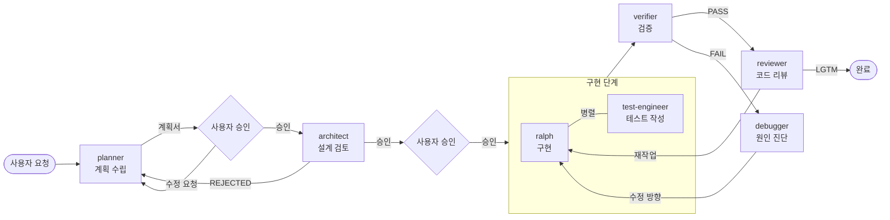
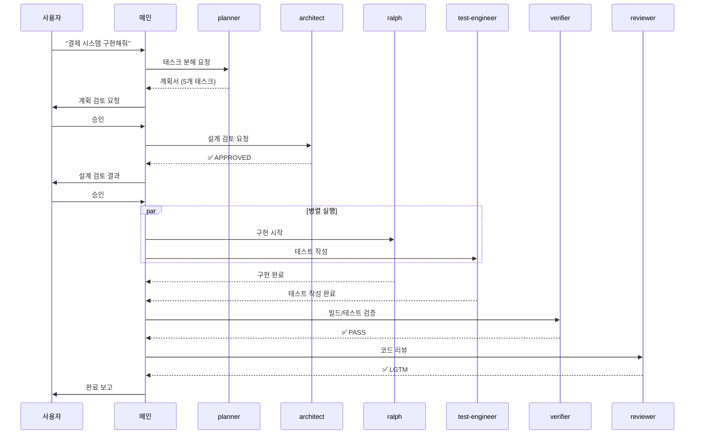
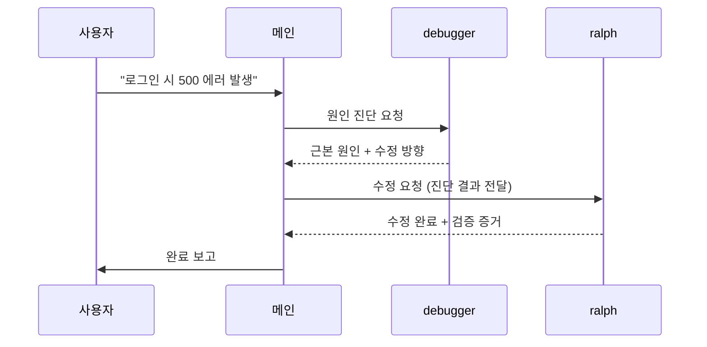
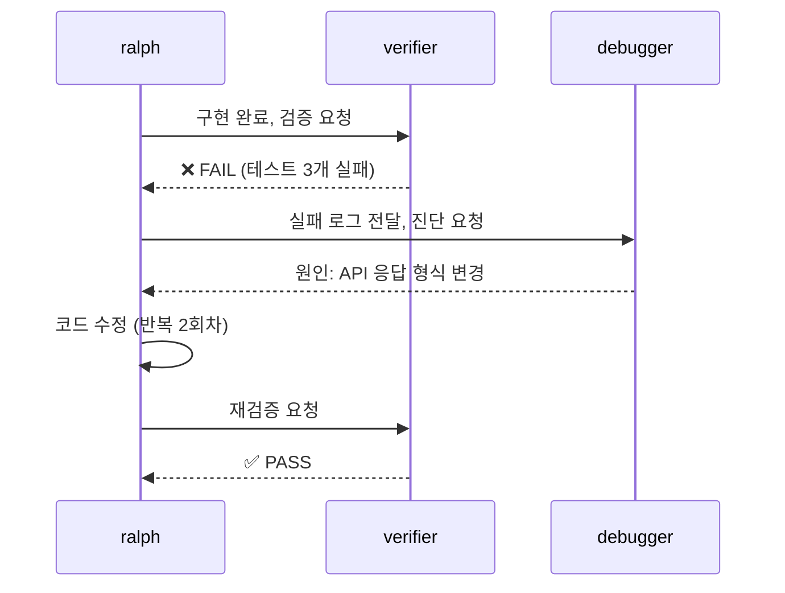
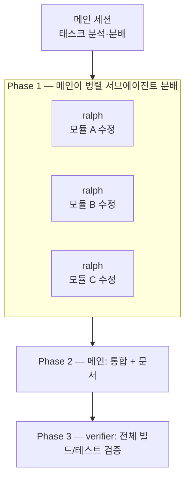
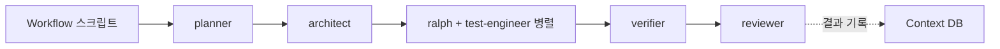
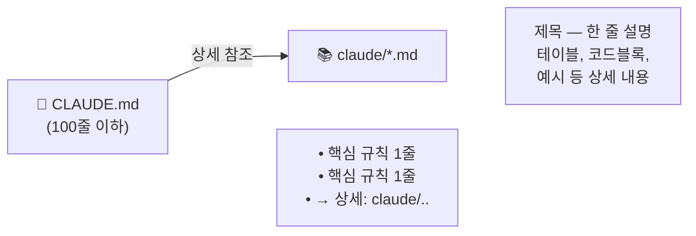

# dotclaude

Claude Code를 더 똑똑하게 — 에이전트, 자동 기록, 실시간 HUD를 한번에 세팅

명령어 하나(`/dotclaude-init`)로 프로젝트에 자동화된 개발 환경이 만들어집니다.

---

## 이런 문제를 해결합니다

| 문제 | dotclaude 적용 후 |
|------|------------------|
| 세션(대화창)이 바뀌면 이전 작업 맥락이 리셋됨 | 작업 내용을 DB에 자동 기록 → 다음 세션에서 자동 복구 |
| 대화가 길어지면 Claude가 편집 중이던 파일을 잊음 (compaction) | Hook이 작업 중 파일과 에러 정보를 자동 캡처해 복구 |
| 큰 기능을 요청하면 설계 없이 바로 코딩해서 엉켜버림 | planner → architect → 구현 → 검증 파이프라인 자동화 |
| Rate limit (사용량 한도) 초과 직전인지 모르고 차단됨 | HUD가 세션/주간 사용량을 실시간으로 표시 |
| 장시간 작업을 걸어두면 완료 여부를 모름 | Telegram 알림으로 작업 완료/에러 즉시 통보 |
| 프로젝트마다 에이전트, 훅, DB를 일일이 세팅해야 함 | `/dotclaude-init` 한 번으로 전체 환경 자동 생성 |
| 스펙 문서가 늘며 중복·과설계·누락·버전을 파악하기 어려움 | SDD 가이드라인 + `spec-guard`가 스펙을 저장·추가하는 순간 영향도·범위·정합성을 자동 분석 |
| 하니스 문서와 내 프로젝트 문서가 섞여 헷갈림 | 하니스=`claude/`(읽기전용)·프로젝트=`specs/`로 소유권 분리 |

---

## 설치

### 원라인 설치 (추천)

```bash
curl -fsSL https://raw.githubusercontent.com/leonardo204/dotclaude/main/install.sh | bash
```

기존 `~/.claude/` 설정이 있으면 `~/.claude.pre-dotclaude/`로 자동 백업됩니다.

### 수동 설치

```bash
git clone https://github.com/leonardo204/dotclaude.git
cd dotclaude && bash install.sh
```

### 프로젝트 초기화

설치 후 프로젝트 폴더에서 Claude Code를 열고 아래 명령어를 실행합니다:

```
/dotclaude-init        # 새 프로젝트 — .claude/ 환경 자동 생성
/dotclaude-update      # 기존 프로젝트 — 최신 업데이트 적용
```

> 배포 대상은 `manifest.json` 단일 소스로 정의되고, 버전(git SHA)이 이미 최신이면 재설치를 건너뜁니다. 그래서 한 PC의 여러 프로젝트에서 `/dotclaude-update`를 돌려도 공통 환경(HUD·글로벌 설정)은 처음 한 번만 갱신됩니다.

---

## 주요 기능

### 🤖 자동 에이전트 시스템

7개의 전문 에이전트가 역할을 나눠 복잡한 작업을 처리합니다. 각 에이전트는 역할 특성에 맞는 모델이 배정됩니다.

| 에이전트 | 역할 | 모델 | effort | 코드 수정 |
|----------|------|:----:|:----:|:---------:|
| **ralph** | 끈질긴 구현 — 빌드+테스트 통과까지 절대 멈추지 않음 | Opus | high | 가능 |
| **planner** | 요청 분석 → 태스크 분해 + 수용 기준 정의 | Opus | high | 불가 |
| **architect** | 설계 및 아키텍처 타당성 검토 | Opus | high | 불가 |
| **verifier** | 빌드/테스트/타입체크 결과 기반 검증 | Sonnet | low | 불가 |
| **reviewer** | 코드 리뷰 — 2단계 프로세스(발견→필터링)로 이슈 누락 방지 | Opus | high | 불가 |
| **debugger** | 버그/에러 근본 원인 진단 — 가설 집중 검증 | Opus | high | 불가 |
| **test-engineer** | 테스트 전략 수립 + 테스트 코드 작성 | Sonnet | medium | 가능 |

**모델·effort 배정 원칙** (Opus 4.8 기준):
- **Opus** — 깊은 추론이 핵심인 역할(계획·설계 검토·코드 리뷰·근본 원인 진단)과 long-horizon 구현(ralph). 4.8의 long-context·도구 트리거 개선으로 구현에도 적합
- **Sonnet** — 도구 호출 빈도가 높거나 단순한 실행 역할(테스트 작성, 빌드/테스트 검증). effort로 노력 수준 제어
- **effort** — Opus 4.8 노력 수준 제어: 분석·판단형·장기 구현(ralph) `high`, 테스트 작성 `medium`, 검증 `low` (서브에이전트 frontmatter는 `high`가 최대 권장 — `xhigh`는 세션/API 레벨 값)
- ⚠️ Haiku 4.5는 effort 파라미터 미지원 → 노력 제어가 필요한 verifier는 Sonnet+low로 배정

#### 팀 모드 (구현 파이프라인)

"로그인 기능 추가해줘"처럼 규모 있는 요청을 받으면 에이전트들이 팀으로 자동 협업합니다.

> **대규모·재현이 필요할 때**: 이 파이프라인을 `.claude/workflows/dotclaude-implement.js`(Opus 4.8 Workflow)로 결정적 실행할 수 있습니다. `agentType`으로 동일한 7개 에이전트를 오케스트레이션하며, 비용이 크므로 명시적 opt-in(대규모 작업·`ultracode`)에만 사용합니다. 일상 작업의 기본은 위 수동 파이프라인입니다.


```mermaid
flowchart LR
    User([사용자 요청]) --> P[planner<br/>계획 수립]
    P -->|계획서| Approve1{사용자 승인}
    Approve1 -->|승인| A[architect<br/>설계 검토]
    Approve1 -->|수정 요청| P
    A -->|승인| Approve2{사용자 승인}
    A -->|REJECTED| P
    Approve2 -->|승인| Impl

    subgraph Impl [구현 단계]
        R[ralph<br/>구현] ---|병렬| T[test-engineer<br/>테스트 작성]
    end

    Impl --> V[verifier<br/>검증]
    V -->|PASS| Rev[reviewer<br/>코드 리뷰]
    V -->|FAIL| D[debugger<br/>원인 진단]
    D -->|수정 방향| R
    Rev -->|LGTM| Done([완료])
    Rev -->|재작업| R
```

**팀 모드 발동 조건**:

| 조건 | 예시 | 동작 |
|------|------|------|
| 새 기능 + 2개 이상 파일 수정 예상 | "로그인 기능 추가해줘" | 파이프라인 자동 제안 |
| 아키텍처 변경 수반 | "인증을 JWT에서 세션으로 바꿔줘" | 파이프라인 자동 제안 |
| "구현해줘/만들어줘" + 구체적 명세 | "댓글 시스템 구현해줘" | 파이프라인 자동 제안 |
| `/dotclaude-implement` 명시 실행 | `/dotclaude-implement` | 즉시 파이프라인 실행 |
| 단순 수정/버그 수정 | "이 에러 고쳐줘" | ralph 단독 또는 직접 처리 |

#### 시나리오별 에이전트 동작

**시나리오 1: 새 기능 구현** — "결제 시스템 구현해줘"


```mermaid
sequenceDiagram
    participant U as 사용자
    participant M as 메인
    participant P as planner
    participant A as architect
    participant R as ralph
    participant T as test-engineer
    participant V as verifier
    participant Rev as reviewer

    U->>M: "결제 시스템 구현해줘"
    M->>P: 태스크 분해 요청
    P-->>M: 계획서 (5개 태스크)
    M->>U: 계획 검토 요청
    U->>M: 승인
    M->>A: 설계 검토 요청
    A-->>M: ✅ APPROVED
    M->>U: 설계 검토 결과
    U->>M: 승인

    par 병렬 실행
        M->>R: 구현 시작
        M->>T: 테스트 작성
    end

    R-->>M: 구현 완료
    T-->>M: 테스트 작성 완료
    M->>V: 빌드/테스트 검증
    V-->>M: ✅ PASS
    M->>Rev: 코드 리뷰
    Rev-->>M: ✅ LGTM
    M->>U: 완료 보고
```

**시나리오 2: 버그 수정** — "로그인 시 500 에러 발생"


```mermaid
sequenceDiagram
    participant U as 사용자
    participant M as 메인
    participant D as debugger
    participant R as ralph

    U->>M: "로그인 시 500 에러 발생"
    M->>D: 원인 진단 요청
    D-->>M: 근본 원인 + 수정 방향
    M->>R: 수정 요청 (진단 결과 전달)
    R-->>M: 수정 완료 + 검증 증거
    M->>U: 완료 보고
```

**시나리오 3: 검증 실패 → 자동 복구** — verifier가 FAIL을 반환한 경우


```mermaid
sequenceDiagram
    participant R as ralph
    participant V as verifier
    participant D as debugger

    R->>V: 구현 완료, 검증 요청
    V-->>R: ❌ FAIL (테스트 3개 실패)
    R->>D: 실패 로그 전달, 진단 요청
    D-->>R: 원인: API 응답 형식 변경
    R->>R: 코드 수정 (반복 2회차)
    R->>V: 재검증 요청
    V-->>R: ✅ PASS
```

**시나리오 4: 대규모 — 메인 세션 주도 병렬** — 독립 태스크를 메인이 병렬 분배

> 서브에이전트(ralph 등)는 다른 서브에이전트를 생성할 수 없습니다(Claude Code 제약). 따라서 병렬 fan-out은 **메인 세션**이 소유하며, 각 서브에이전트는 자기 태스크를 직접 수행합니다.


```mermaid
flowchart TD
    M[메인 세션<br/>태스크 분석·분배] --> Phase1

    subgraph Phase1 [Phase 1 — 메인이 병렬 서브에이전트 분배]
        C1[ralph<br/>모듈 A 수정]
        C2[ralph<br/>모듈 B 수정]
        C3[ralph<br/>모듈 C 수정]
    end

    Phase1 --> Phase2[Phase 2 — 메인: 통합 + 문서]
    Phase2 --> Phase3[Phase 3 — verifier: 전체 빌드/테스트 검증]
```

**시나리오 5: 대규모 작업 → Workflow** — 수십 파일·감사·마이그레이션 (Opus 4.8, opt-in)

위 팀 모드를 **결정적 스크립트**로 굳힌 형태입니다. `agentType`으로 동일한 7개 에이전트를 코드로 오케스트레이션하며, 중간 결과가 메인 대화 컨텍스트를 채우지 않아 대규모 작업에 유리합니다. 번들 워크플로우: `.claude/workflows/dotclaude-implement.js`


```mermaid
flowchart LR
    W[Workflow 스크립트] --> P[planner]
    P --> A[architect]
    A --> B[ralph + test-engineer 병렬]
    B --> V[verifier]
    V --> Rev[reviewer]
    Rev -.결과 기록.-> DB[Context DB]
```

> 비용이 크므로 `workflow`/`ultracode` 명시 시에만 발동합니다. 일상 작업의 기본은 위 수동 팀 모드입니다.

#### 단독 에이전트 사용

팀 모드가 아닌 개별 에이전트만 호출되는 경우:

| 상황 | 호출 에이전트 | 예시 |
|------|:------------:|------|
| 단순 버그 수정 | ralph | "이 버튼 클릭 안 돼요" |
| 코드 리뷰만 | reviewer | "이 PR 리뷰해줘" |
| 테스트 보강 | test-engineer | "이 모듈 테스트 추가해줘" |
| 원인 분석만 | debugger | "왜 빌드가 안 되는지 알려줘" |
| 설계 피드백 | architect | "이 구조 괜찮을까?" |
| 작업 계획만 | planner | "이거 하려면 뭘 해야 해?" |
| 구현 완료 후 검증 | verifier | 구현 후 자동 호출 |

**Ralph 에이전트**: 핵심 구현 에이전트. 빌드 에러가 나면 고치고, 테스트가 실패하면 수정하고, 완료 조건이 충족될 때까지 최대 10회 반복합니다. "대략 동작합니다"를 허용하지 않습니다. 독립 태스크가 2개 이상이면 직접 순차 처리하거나, 메인 세션에 병렬 분배를 위임합니다(서브에이전트는 child를 직접 생성할 수 없음).

**에이전트 공통 원칙**: 모든 에이전트는 도구 사용 명시(추측 금지), 작업 범위 한정, 단일 접근 헌신(결정 후 재검토 금지) 원칙을 따릅니다. 병렬 팬아웃(독립 작업 동시 실행)은 **메인 세션이 수행**합니다 — 서브에이전트는 다른 서브에이전트를 직접 생성할 수 없습니다.

---

### 🛡️ 컨텍스트 보호 & 세션 연속성

> Opus 4.8의 **1M 컨텍스트**로 compaction(대화 압축) 빈도가 크게 줄었습니다. dotclaude는 Context DB의 무게추를 **"compaction 복구" → "세션 간 연속성 + 메모리 품질"**로 옮겼습니다. (DB 파일은 세션이 바뀌어도 물리적으로 유지됩니다.)

**1. 세션 간 연속성** — 새 대화창이 직전 작업을 즉시 이어받습니다.

- **핸드오프 주입**: 세션 종료 시 편집 파일·커밋·결정을 구조화해 `session_handoff`에 저장 → 다음 세션 시작에 자동 주입. LLM 요약이 아니라 사실 블록이라 손실이 없습니다.

> 사실·학습·선호의 영속 메모리는 Claude Code 네이티브 **auto-memory**(`/memory`)를 씁니다. Context DB는 운영 이력과 compaction-safe 핸드오프에 특화돼 있습니다.

**2. Compaction 안전망** — 빈도는 줄었지만 여전히 대비합니다.

| 항목 | 캡처 시점 | 내용 |
|------|-----------|------|
| `session_handoff` | 세션 종료 시 | 편집·커밋·결정 → **다음 세션 주입** |
| `working_files` | 컨텍스트 70% 도달 시 | 편집 중인 파일 경로 (최대 20개) |
| `error_context` | 에러 발생 시 | 에러 유형 + 관련 파일 경로 |
| `_rules` | 세션 시작 시 | CLAUDE.md 핵심 지침 |
| `current_task` | 수동 저장 | 현재 진행 중인 작업 설명 |

**3단계 차등 주입**: 매 턴 컨텍스트 사용률에 따라 — 기본(70% 미만, 핸드오프) → 경고(70~90%, working_files·error_context 추가) → 복구(compaction 감지 시 DB에서 전체 상태 복원).

> 상세: `claude/context-db.md`, `claude/context-monitor.md`

---

### 📊 HUD (실시간 상태 표시줄)

Claude Code 하단에 현재 사용량과 환경 정보를 실시간으로 표시합니다.

```
[CC#1.0.80] | ~/work/myproject (main) | $12.90 (today $1.2) | 5h:39%(2h37m) wk:15%(4d7h) | Opus | ctx:14% | agents:3
 ─────────    ───────────────────────   ───────────────────   ────────────────────────────   ────   ───────   ────────
  CC 버전        작업 경로(브랜치)         누적 비용(오늘)      세션 사용량    주간 사용량   모델    맥락%   활성 에이전트
```

| 항목 | 설명 |
|------|------|
| CC 버전 | 현재 Claude Code 버전 |
| 작업 경로 | 현재 디렉토리 + git 브랜치 |
| 누적 비용 | 프로젝트 로그(JSONL)를 ccusage 방식으로 집계한 누적 예상 비용(USD) + 오늘 사용량. `messageId:requestId` 중복제거 + 모델별 flat 단가. 계산은 백그라운드 워커(`cost.js`), statusline은 캐시만 읽음 |
| 세션 사용량 | 이번 세션에서 소모한 Rate limit 비율 + 남은 시간 |
| 주간 사용량 | 이번 주 누적 사용량 비율 |
| 모델 | 현재 사용 중인 Claude 모델 |
| 맥락% | 현재 대화 컨텍스트 사용률 |
| 활성 에이전트 | 현재 실행 중인 서브에이전트 수 |

HUD는 Claude Code가 statusline에 직접 주는 stdin 데이터(rate limit·컨텍스트·모델 등)를 읽어 즉시 렌더링하므로 API 블로킹이나 응답 지연이 없습니다. (rate limit 데이터의 정확한 출처는 아래 참고)

**HUD 설치 범위**: `install.sh` 실행 시 Global(모든 프로젝트), Project(dotclaude-init한 프로젝트만), Skip(미설치) 중 선택할 수 있습니다. 설치 후에도 `/dotclaude-statusline` 명령으로 언제든 on/off 전환이 가능합니다.

> **Rate limit 데이터 출처 (투명성)**: 사용량(5h/wk)은 Claude Code가 statusline에 직접 주는 `rate_limits`(CC 2.1+, Pro/Max)를 **1차로** 사용합니다. 이 값이 없는 환경(첫 API 응답 전 등)에서만, 백그라운드 fetcher가 `api.anthropic.com/api/oauth/usage`를 로컬 OAuth 토큰(macOS Keychain 또는 `~/.claude/.credentials.json`)으로 조회해 캐시를 채웁니다. 외부 전송은 없으며, fetcher는 `/dotclaude-statusline off` 또는 `~/.claude/.hud_disabled`로 비활성화할 수 있습니다.

---

### 📱 Telegram 메신저 알림 (발신 특화)

Claude Code 작업이 끝나면 **Telegram**으로 프로젝트 컨텍스트가 담긴 알림을 받습니다. 장시간 작업을 걸어두고 자리를 비웠을 때, 무엇이 끝났고 얼마나 썼고 다음에 뭘 볼지를 한눈에 확인할 수 있습니다.

```
[dotclaude] 세션 종료
프로젝트: /home/user/my-project (main)
상태: 응답 완료 — 백그라운드 1건 진행 중
시간: 14:30:15 → 15:45:22 (1시간 15분)
파일: 8개
비용: 오늘 $11.14 / 누적 $90.28
한도: 5시간 2% · 7일 14%

요약
<Claude의 마지막 응답 첫 문단>

백그라운드 (1건)
- [running] subagent/planner — ...

핸드오프
<편집 파일 + 최근 결정 요약>
```

비용·레이트리밋·브랜치·커밋·핸드오프·백그라운드 작업은 **네이티브 알림이 담지 못하는 dotclaude 고유 정보**입니다. 재료가 없으면 해당 줄만 생략하고 알림은 보냅니다.

> **양방향(폰에서 지시·승인)은 이 기능이 아니라 Claude Code 네이티브를 쓰세요.**
> dotclaude 메신저는 **발신 전용**입니다. 폰에서 세션을 조종하거나 권한을 원격 승인하려면
> Claude Code의 [Channels](https://code.claude.com/docs/en/channels)(공식 Telegram 플러그인,
> 양방향 챗브릿지 + permission relay)나 [Remote Control](https://code.claude.com/docs/en/remote-control)을
> 사용합니다 — 둘 다 매 세션 `--channels` / `--remote-control` 옵션으로 옵트인합니다.

**설정 방법**:

```
/dotclaude-messenger              # 대화형 가이드 (초기 설정부터 안내)
/dotclaude-messenger config <token> <chat_id>   # 직접 설정
/dotclaude-messenger test         # 테스트 메시지 전송
```

초기 설정에는 Telegram Bot Token과 Chat ID가 필요합니다. `/dotclaude-messenger`를 인자 없이 실행하면 BotFather를 통한 봇 생성부터 단계별로 안내합니다.

**알림 조건 설정**:

| 설정 | 명령어 | 설명 |
|------|--------|------|
| 최소 시간 | `/dotclaude-messenger set min_duration 300` | 5분 미만 작업은 알림 스킵 |
| 알림 범위 | `/dotclaude-messenger set scope global` | 모든 프로젝트 또는 특정 프로젝트만 |
| on/off | `/dotclaude-messenger on` / `off` | 알림 활성화/비활성화 |

설정은 `~/.claude/messenger.json`에 저장되며 모든 프로젝트에서 공유됩니다. 다른 PC에서는 `install.sh` 실행 후 `/dotclaude-messenger config`로 토큰만 설정하면 됩니다.

---

### ⚡ 커스텀 명령어

**프로젝트 명령어** (프로젝트 내에서 사용):

| 명령어 | 설명 |
|--------|------|
| `/project:dotclaude-help` | 명령어 및 에이전트 목록 표시 |
| `/project:dotclaude-implement` | 전체 파이프라인 (계획 → 설계 → 구현 → 검증 → 리뷰) 실행 |
| `/project:dotclaude-commit` | 변경 분석 + 문서 업데이트 + 기능별 커밋 |
| `/project:dotclaude-tellme` | 최근 작업 브리핑 + 다음 할 일 제안 |
| `/project:dotclaude-discover` | DB 패턴 분석 → 자동화 제안 |
| `/project:dotclaude-reportdb` | Context DB 전체 현황 리포트 |
| `/project:dotclaude-statusline` | HUD on/off 토글 (`on` / `off` 인자 지원) |
| `/project:dotclaude-messenger` | Telegram 알림 설정/테스트/토글 (`config` / `test` / `on` / `off` / `send` / `status`) |

**글로벌 명령어** (모든 프로젝트에서 사용):

| 명령어 | 설명 |
|--------|------|
| `/dotclaude-init` | 프로젝트에 dotclaude 환경 초기화 |
| `/dotclaude-update` | dotclaude 시스템 파일 최신 업데이트 |

**사용 예시**:

```
# 기능 구현 요청 — 파이프라인이 자동으로 계획부터 리뷰까지 처리
/project:dotclaude-implement
> 사용자 인증 기능을 JWT 방식으로 구현해줘

# 오늘 작업 현황 확인
/project:dotclaude-tellme
```

---

### 📄 Slim 문서 정책

CLAUDE.md는 **매 턴 모델에 입력**되므로, 길어지면 응답 속도가 느려집니다. dotclaude는 이를 방지하기 위해 Slim 정책을 적용합니다.

**원칙**: CLAUDE.md는 100줄 이하 유지. 상세 내용은 하니스 문서(`claude/`)로 분리.


```mermaid
graph LR
    A["📄 CLAUDE.md<br>(100줄 이하)"] -->|상세 참조| B["📚 claude/*.md"]

    A ~~~ A1["• 핵심 규칙 1줄<br>• 핵심 규칙 1줄<br>• → 상세: claude/.."]
    B ~~~ B1["제목 — 한 줄 설명<br>테이블, 코드블록,<br>예시 등 상세 내용"]
```

**하니스 문서 헤더 규칙**: 모든 참고 문서는 `# 제목 — 한 줄 설명` 형식의 첫 줄을 가집니다. 모델이 파일을 열지 않고도 필요한 문서인지 빠르게 판단할 수 있습니다.

**하니스 문서** — `/dotclaude-init` 시 프로젝트의 `{문서폴더}/claude/`(🔒 읽기전용)에 배포됩니다. (dotclaude repo 소스: `ref-docs/`)

| 문서 (`claude/`) | 설명 |
|------|------|
| `agent-delegation.md` | 에이전트 위임 규칙, 파이프라인, 호출 패턴 |
| `context-db.md` | Context DB 스키마, helper.sh 명령어 |
| `context-monitor.md` | HUD + compaction 감지/복구 |
| `hooks.md` | 5개 Hook 역할, 시점, 성능 최적화 |
| `conventions.md` | 커밋, 주석, 로깅 컨벤션 |
| `setup.md` | 새 환경 초기 설정 가이드 |
| `sdd.md` | SDD 스펙 문서 작성/관리 최소 공통 가이드라인 |

> 프로젝트 스펙 문서는 `{문서폴더}/specs/`에 작성합니다(사용자 소유). → 위 "📝 SDD 스펙 관리" 참고

**새 지침 추가 시**:
1. 매 턴 참조 필요 → CLAUDE.md에 1줄 추가
2. 상세/예시/테이블 → 별도 문서로 분리 후 CLAUDE.md에서 참조 (하니스는 `claude/`, 프로젝트는 `specs/`)
3. 프로젝트별 규칙 → 프로젝트 CLAUDE.md의 PROJECT 섹션에 추가

---

### 📝 SDD 스펙 관리 (spec-guard)

스펙 주도 개발(SDD)에는 절대 표준이 없어, dotclaude는 **최소 공통 가이드라인**과 정합성 분석 skill을 제공합니다.

**문서 소유권 분리** (`/dotclaude-init` 시 자동):

- `{문서폴더}/claude/` — 🔒 하니스 문서 (읽기 전용, `dotclaude-update`가 덮어씀)
- `{문서폴더}/specs/` — 📝 프로젝트 스펙 (자유 작성)

**`spec-guard` skill** — read-only 분석. 문서를 직접 수정하지 않고 **권고만** 합니다.

| 발동 시점 | 분석 |
|----------|------|
| 스펙 검토 요청 / `/spec-guard` | 영향도 맵 · 중복/관련도 · 범위(over/under) · 누락 · 문서 개수 · 버전 6관점 |
| 계획·설계를 md로 저장한 직후 | 방금 저장된 문서를 기존 스펙과 대조 |
| 외부 스펙을 `specs/`에 복사·추가 | 추가된 문서의 frontmatter·중복·정합성 점검 |

> **저장·복사 행위 자체를 "스펙 작성"으로 보고 자동 발동**합니다. 가이드라인: `claude/sdd.md`

---

## 요구 사항

- **Claude Code** (CLI)
- **Node.js 22 이상** (내장 SQLite 모듈 사용)
- **sqlite3** (CLI 도구 — 없으면 install.sh가 자동 설치)

---

## 제거

```bash
# 로컬 실행 (확인 프롬프트 표시)
bash uninstall.sh

# 원격 실행
curl -fsSL https://raw.githubusercontent.com/leonardo204/dotclaude/main/uninstall.sh | bash -s -- -y
```

dotclaude가 설치한 파일만 삭제하며, 사용자가 추가한 파일은 보존됩니다.

---

## License

MIT
